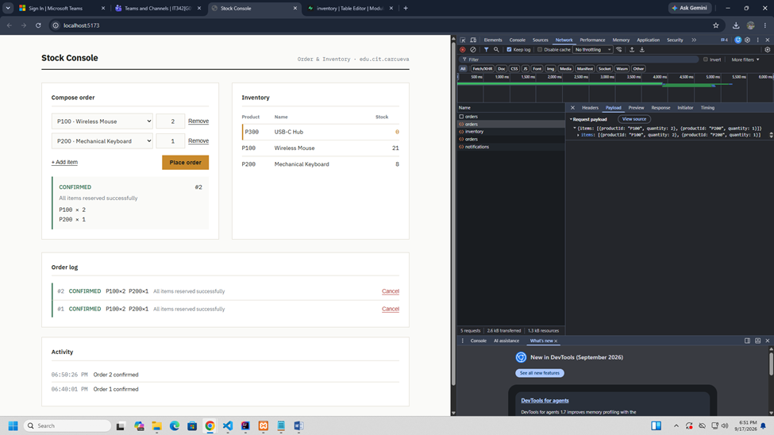
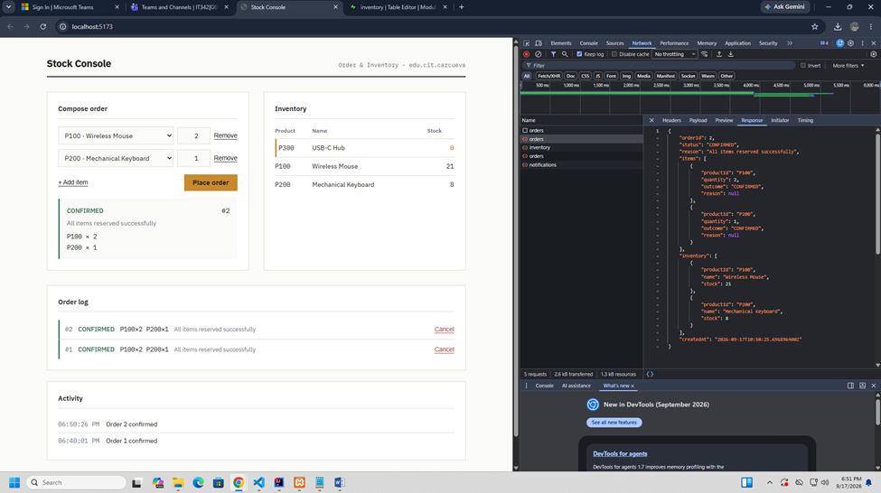
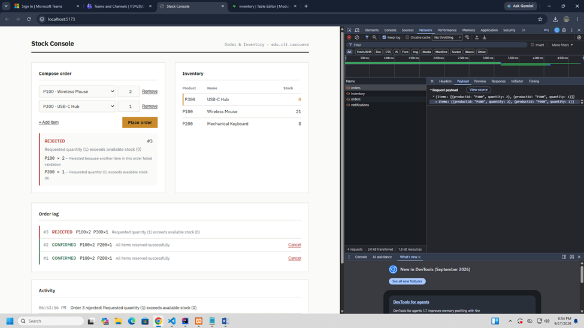
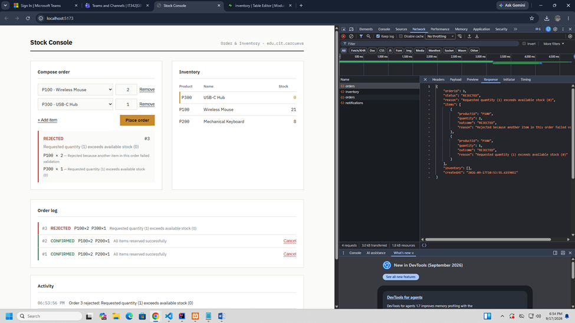
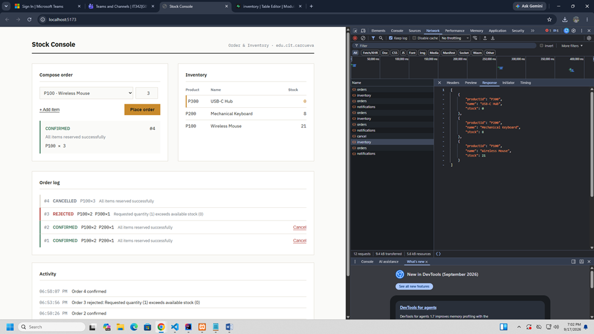
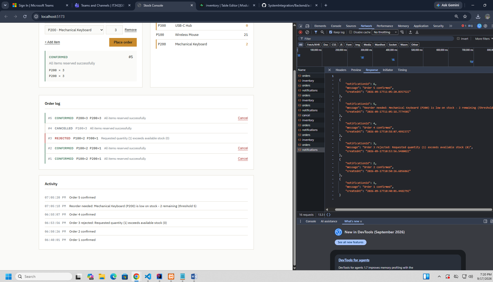

# Lab 2: Extending the Modular Monolith

Java Spring Boot (Order + Inventory + new Notification modules, in-process) + Supabase (Postgres) + React.

Builds on Lab 1: same three modules' boundary rules apply, plus a new
Notification module wired up via Spring's in-process event publishing
(`ApplicationEventPublisher` / `@EventListener`) rather than a direct
method call.

## Project layout

```
backend/    Spring Boot app
  edu.cit.carcueva.shop          Order module (unchanged package name)
  edu.cit.carcueva.inventory     Inventory module (unchanged package name)
  edu.cit.carcueva.notification  NEW Notification module
frontend/   React (Vite) client — cart-based multi-item order form,
            live inventory table, order history with Cancel, notification feed
sql/        schema.sql — recreates the full schema from scratch, including seed data
```

## 1. Supabase setup (carried over from Lab 1 — unchanged)

1. Create a free project at supabase.com (or reuse your Lab 1 project).
2. Open the SQL editor and run `sql/schema.sql`. **This script drops and
   recreates `inventory`, `orders`, `order_items`, and `notifications`
   from scratch** — it's safe to re-run even if you already have the
   Lab 1 schema in place, and it reseeds P100 (25), P200 (10), P300 (0).
3. Get your connection string from **Project Settings → Database →
   Connect**. If you hit a DNS/`UnknownHostException` on the direct
   connection string, use the **Session pooler** string instead (host
   like `aws-0-<region>.pooler.supabase.com`, username formatted as
   `postgres.<project-ref>`).

## 2. Backend setup

Requires JDK 17 and Maven (or just use your IDE's bundled Maven, e.g.
IntelliJ's Maven panel + a Run Configuration with these as Environment
variables instead of a shell `.env`).

```
cd backend
cp .env.example .env   # fill in your real Supabase values, .env is gitignored
```

```
export SUPABASE_DB_URL=jdbc:postgresql://<host>:5432/postgres
export SUPABASE_DB_USERNAME=postgres.<project-ref>
export SUPABASE_DB_PASSWORD=<your-password>
export CORS_ALLOWED_ORIGIN=http://localhost:5173

mvn spring-boot:run
```

The API starts on `http://localhost:8080`.

## 3. Frontend setup

```
cd frontend
npm install
npm run dev
```

Opens on `http://localhost:5173`.

## 4. API surface

| Method | Path | Purpose |
|---|---|---|
| POST | `/api/orders` | Place a multi-item order — `{ items: [{ productId, quantity }, ...] }`. All-or-nothing: validates every line against current stock before reserving anything. |
| GET | `/api/orders` | Order history, each with its line items and status. |
| POST | `/api/orders/{orderId}/cancel` | Cancel a CONFIRMED order and restock every line item. 404 if the order doesn't exist, 409 if already cancelled. |
| GET | `/api/inventory` | All products with current stock. |
| GET | `/api/notifications` | Notification log (order confirmations/rejections, low-stock alerts), newest first. |

## 5. Testing all four required scenarios

- **Multi-item order, all succeed (CONFIRMED):** e.g. `{"items":[{"productId":"P100","quantity":2},{"productId":"P200","quantity":1}]}`.
- **Multi-item order, one item fails (REJECTED, no partial reservation):** e.g. add a P300 (stock 0) line to an otherwise-fine order, then check `GET /api/inventory` afterward to confirm the P100/P200 stock did NOT move.
- **Cancel with restock reflected in GET /api/inventory:** place a CONFIRMED order, note the stock drop in the inventory table, click Cancel, and confirm the stock returns to its pre-order value.
- **Notification feed showing all three entry types:** after the above, `GET /api/notifications` (or the Notifications panel in the UI) should show an order-confirmed entry, an order-rejected entry, and — if any reservation dropped a product below the threshold of 5 — a low-stock "reorder needed" entry.

**Confirmed multi-item order — request payload:**


**Confirmed multi-item order — response:**


**Rejected multi-item order (no partial reservation) — request payload:**


**Rejected multi-item order — response:**


**Cancel — restock reflected in GET /api/inventory:**


**Notification feed — confirmed, rejected, and low-stock entries:**


## 6. On `@Async`

The Notification module's `@EventListener` methods run **synchronously**
(no `@Async`). For this lab, a notification write is a single cheap
insert, and running it inline guarantees a notification exists by the
time the triggering HTTP request (order placement, cancellation) returns
— which makes the required Network-tab evidence deterministic instead of
racy. The trade-off is that Notification's write latency is on the
critical path of Order's and Inventory's requests, and an exception in a
listener would currently propagate back into the request that triggered
it. Making these listeners `@Async` would remove that coupling at the
cost of losing the "notification is guaranteed to exist by response
time" guarantee — worth doing once Notification does something heavier
than a single insert (e.g. calling an email/SMS provider).

---

## Reflection

**1. Multi-item orders now touch InventoryService several times within one request. What ensures this stays atomic in-process, and what would you need to add (e.g. sagas, compensating transactions) if Order and Inventory were split across a network?**

`OrderService.placeOrder` first validates every line item against current stock with read-only calls, before reserving anything — so most rejections never touch the database at all. The interesting case is the race condition: pre-validation passes, but a concurrent order consumes the same stock before this order's reservations run. To handle that correctly, the actual reservation loop lives in a separate `@Transactional` method (`OrderTransactionExecutor.reserveAndConfirm`), and because Order and Inventory share one Spring `DataSource`/`PlatformTransactionManager` in this monolith, calling `InventoryService.reserve()` from inside that method joins the *same* database transaction by Spring's default `REQUIRED` propagation. If the third item in a three-item order fails its reservation, throwing an unchecked exception rolls back the first two `reserve()` calls **and** the not-yet-committed order/order_items rows together, atomically, in one database COMMIT/ROLLBACK. I get this for free purely because everything runs inside one JVM against one database connection pool.

Split across a network, that shared transaction disappears — Inventory's database and Order's database (if separate) can't roll back together with a single COMMIT. I'd need either a saga: reserve items one at a time, and if any reservation fails, explicitly call compensating "release/unreserve" requests for every item already reserved in this order; or a two-phase pattern where Inventory holds a *tentative* reservation (not yet decremented) until Order confirms the whole order, then either commits all tentative reservations or releases all of them. Either way, I'd also need idempotency keys on the reserve/release calls, since retries after a network timeout could otherwise double-reserve or double-release, and some way to detect and clean up an order that failed to confirm within a time window (an orphaned tentative reservation).

**2. How does publishing an event instead of calling Notification directly change the coupling between OrderService and Notification? What would you need if Notification became a separate microservice?**

With a direct call, `OrderService` would need a compile-time dependency on Notification's public interface, and Notification's availability/latency would sit directly on Order's request path — if Notification's method threw, that exception would propagate straight back into the order placement call. With `ApplicationEventPublisher.publishEvent(...)`, `OrderService` doesn't know Notification exists at all; it just publishes a plain data record (`OrderPlacedEvent`/`OrderRejectedEvent`) into the Spring context. Whether zero, one, or five listeners pick that event up is entirely Notification's business, not Order's — I could delete the entire notification package and `OrderService` wouldn't need a single line changed. That's a real reduction in coupling, even though right now both modules still run in the same JVM and the listener still executes synchronously on the same thread as the publish call.

If Notification became a separate microservice, in-process `ApplicationEventPublisher` wouldn't reach it anymore — I'd need an actual message broker (Kafka, RabbitMQ, SQS) that Order publishes `OrderPlacedEvent`/`OrderRejectedEvent` to as serialized messages, and Notification would consume from a queue/topic instead of registering an `@EventListener`. That also means committing to a delivery guarantee: at-least-once delivery (with Notification made idempotent, since the same event could be redelivered) is the realistic choice, since exactly-once is hard to guarantee end-to-end. I'd also need to decide what happens if the broker is down when Order tries to publish — probably an outbox pattern (write the event to a local table in the same transaction as the order, then a separate process relays outbox rows to the broker) so a broker outage doesn't lose or block order placement.

**3. You now have three modules and two distinct event types. If forced to extract exactly one module into its own microservice first, which would you pick and why — and what changes in your code to do it?**

I'd extract **Notification** first. It's the only one of the three modules that is purely a *consumer* — nothing in Order or Inventory imports anything from `edu.cit.carcueva.notification`, and Notification itself only depends on plain event records, never on `OrderService` or `InventoryService`. That one-way dependency is exactly what makes it the lowest-risk thing to pull out: extracting it doesn't force any change to Order's or Inventory's business logic, only to how events reach it. Notification is also the least consistency-critical of the three — if a notification is delayed by a few seconds because it's now going over a message queue instead of an in-process event, nothing breaks; the same is not true if Inventory's reservation were delayed relative to Order's confirmation.

To actually do it: I'd replace the `ApplicationEventPublisher.publishEvent(...)` calls in `OrderService`/`OrderTransactionExecutor` and `InventoryServiceImpl` with publishes to a message broker topic (still using the same `OrderPlacedEvent`/`OrderRejectedEvent`/`LowStockEvent` shapes, now serialized as JSON instead of passed as in-JVM objects), move the `Notification` entity/repository/listener/controller into their own Spring Boot service with their own database and their own `/api/notifications` endpoint, and add an outbox table in Order's and Inventory's databases so publishing an event and committing the triggering write happen atomically even though the broker call itself can't be part of that database transaction. The frontend's notification panel would just point at a different base URL; nothing about Order's or Inventory's public contracts (`InventoryService`, the REST endpoints) would need to change at all.